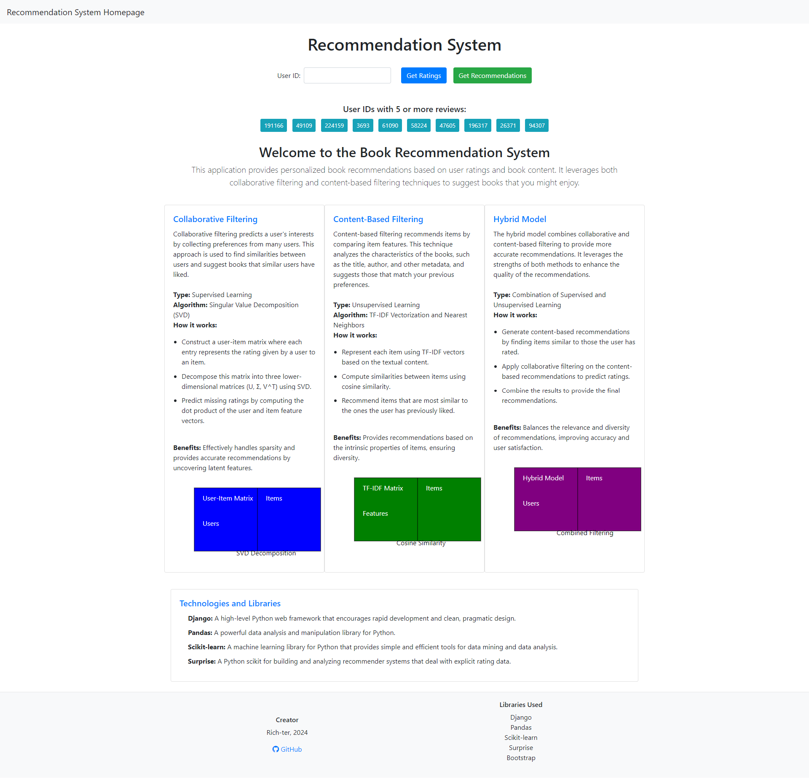
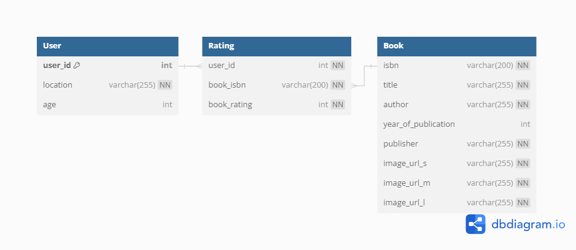
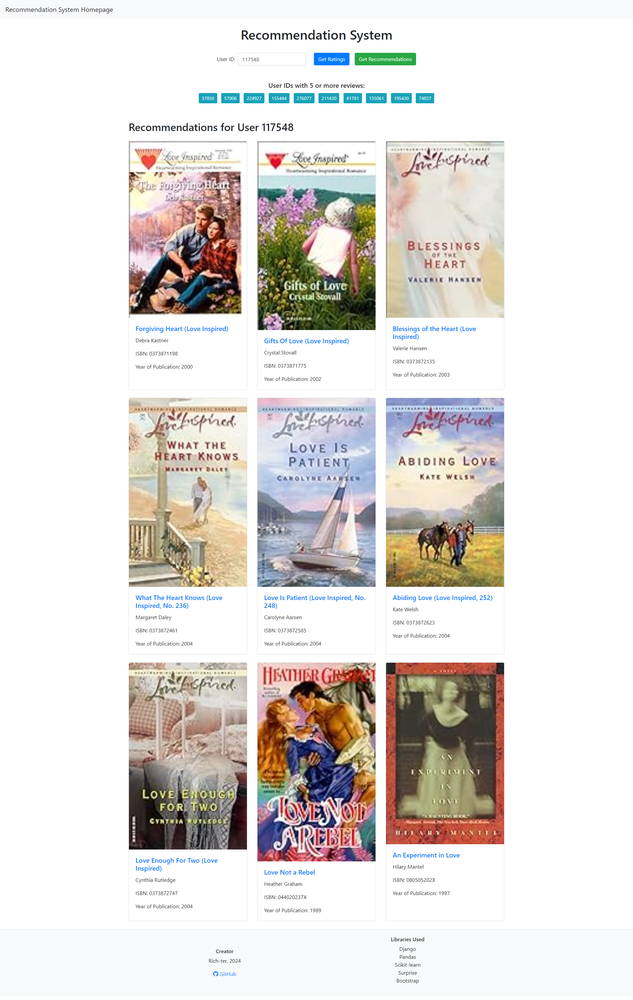
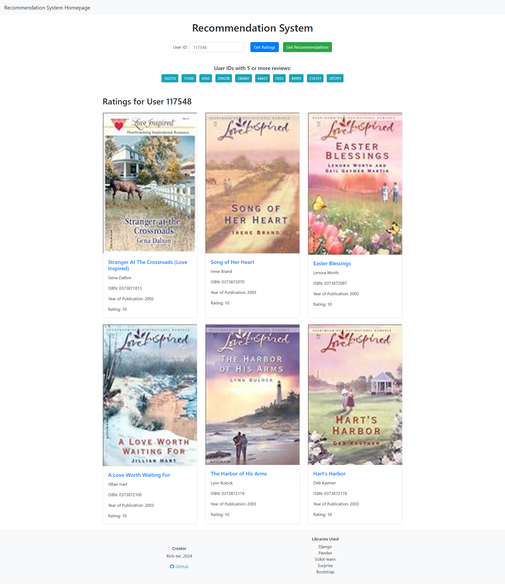
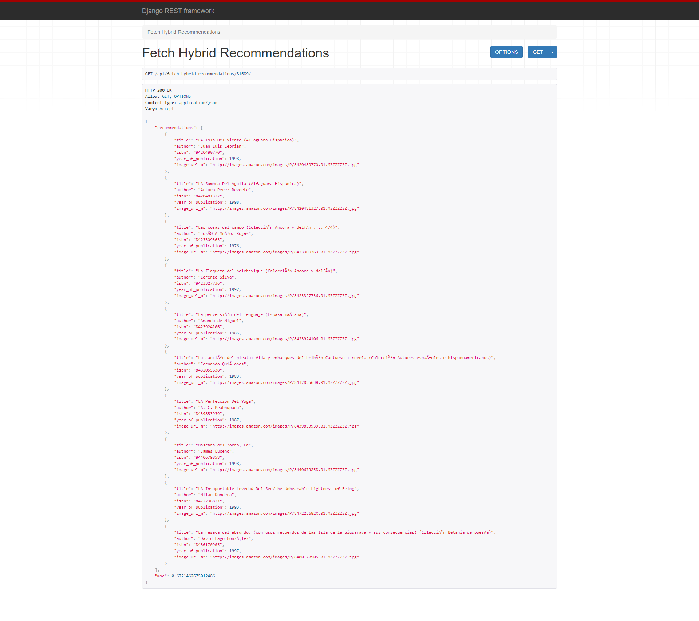
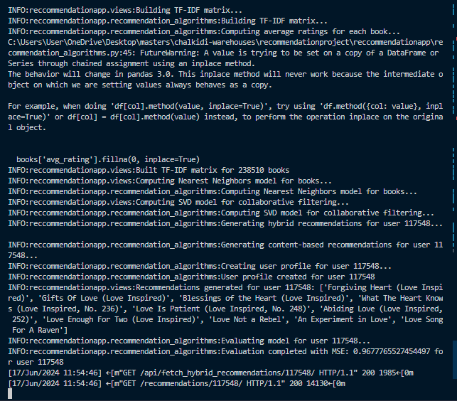

# Book Recommendation System

<!--  -->

## Overview

The Book Recommendation System is a web-based application that leverages both content-based and collaborative filtering techniques to provide personalized book recommendations to users. Built with Django, this system integrates robust machine learning algorithms to analyze user preferences and deliver tailored suggestions.

## Features

- **Content-Based Filtering:** Uses TF-IDF vectorization to analyze book descriptions and recommend books with similar content.
- **Collaborative Filtering:** Utilizes matrix factorization (SVD) to identify user preferences based on ratings and recommend books liked by similar users.
- **Hybrid Recommendations:** Combines both content-based and collaborative filtering methods to improve recommendation accuracy.
- **User Interaction:** Allows users to view personalized recommendations based on their ratings and interactions.
- **API Integration:** Provides an API endpoint for accessing recommendation results programmatically.
- **Mass Import and Preprocessing:** Custom management commands for efficient data import and preprocessing.

## Technology Stack

- **Backend:** Django, Django REST Framework
- **Machine Learning:** scikit-learn, Surprise library
- **Frontend:** HTML, CSS, JavaScript
- **Database:** SQLite (default with Django)

## Key Components

### Database Design

The database schema includes models for books, users, and ratings, ensuring efficient data management and retrieval.



### Content-Based Filtering

Content-based filtering analyzes book descriptions using TF-IDF vectorization to recommend books with similar content to those the user has rated highly. This approach ensures that recommendations are based on the intrinsic properties of the books.

<!--  -->

### Collaborative Filtering

Collaborative filtering uses matrix factorization (SVD) to recommend books based on user rating patterns, finding similarities between users. This approach leverages user behavior to predict preferences.

### Hybrid Model

The hybrid model combines content-based and collaborative filtering techniques, enhancing recommendation accuracy by leveraging the strengths of both methods. This approach provides a balanced recommendation that considers both book content and user behavior.

### User Interface

#### Homepage

The homepage displays random user IDs with their respective ratings, allowing users to explore and interact with the recommendation system.


#### User Ratings

Users can view and rate books, which are then used to generate personalized recommendations.



#### Recommendations

Users receive tailored book recommendations based on their ratings and interactions with the system.


### API

The system includes an API for programmatic access to the recommendation results, allowing integration with other applications.



### Mass Import and Preprocessing

The system supports mass import and preprocessing of data through custom management commands. This feature ensures efficient handling of large datasets and prepares the data for analysis and model training.

## Evaluation

The system's performance is evaluated using Mean Squared Error (MSE), with results indicating the accuracy of the recommendations:

- **Content-Based MSE:** Computed for content-based recommendations.
- **Collaborative-Based MSE:** Computed for collaborative filtering recommendations.
- **Hybrid MSE:** Computed for the combined recommendations.



## Getting Started

### Prerequisites

- Python 3.x
- Django
- Required Python libraries listed in `requirements.txt`

### Installation

1. Clone the repository:

```bash
git clone https://github.com/yourusername/book-recommendation-system.git
cd book-recommendation-system
```

2. Install the dependencies:

```bash
pip install -r requirements.txt
```

3. Set up the Django environment:

```bash
python manage.py migrate
python manage.py runserver
```

4. Access the application at `http://127.0.0.1:8000`.

## Conclusion

The Book Recommendation System is a comprehensive solution for personalized book recommendations, integrating advanced machine learning techniques and a user-friendly web interface. It demonstrates practical skills in backend development, machine learning, and frontend design, making it an attractive project for potential employers.
